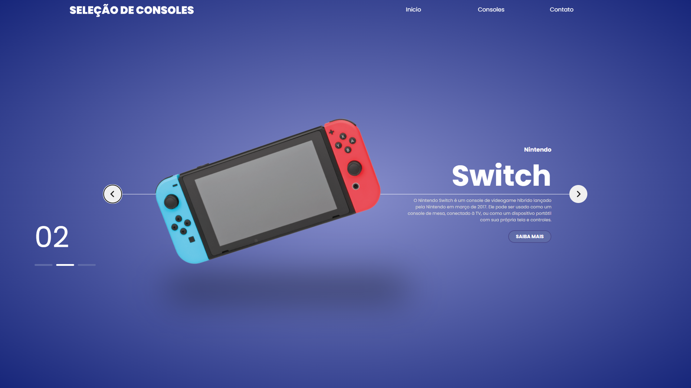

<h1 align="center"> Seleçao de consoles </h1>

Página web desenvolvida para o aperfeiçoamento de minhas habilidades com html, css e java script  

  <a href="#-tecnologias">Tecnologias</a>&nbsp;&nbsp;&nbsp;|&nbsp;&nbsp;&nbsp;
  <a href="#-projeto">Projeto</a>&nbsp;&nbsp;&nbsp;|&nbsp;&nbsp;&nbsp;
  <a href="#-layout">Layout</a>&nbsp;&nbsp;&nbsp;|&nbsp;&nbsp;&nbsp;
  <a href="#memo-licença">Licença</a>

  

 

  

## 🚀 Tecnologias

Esse projeto foi desenvolvido com as seguintes tecnologias:

- HTML e CSS
- JavaScript
- Git e Github

## 💻 Projeto

O seletor de consoles é uma página simples para a visualização dos consoles da nova geração, com uma breve descrição.

Projeto original : (https://www.youtube.com/watch?v=AZ1drCVTDgs&t=1846s) --> Rodolfo Mori.

## :memo: Licença

Esse projeto está sob a licença MIT.

---

Feito com ♥ by Marcos Brhemem :wave: